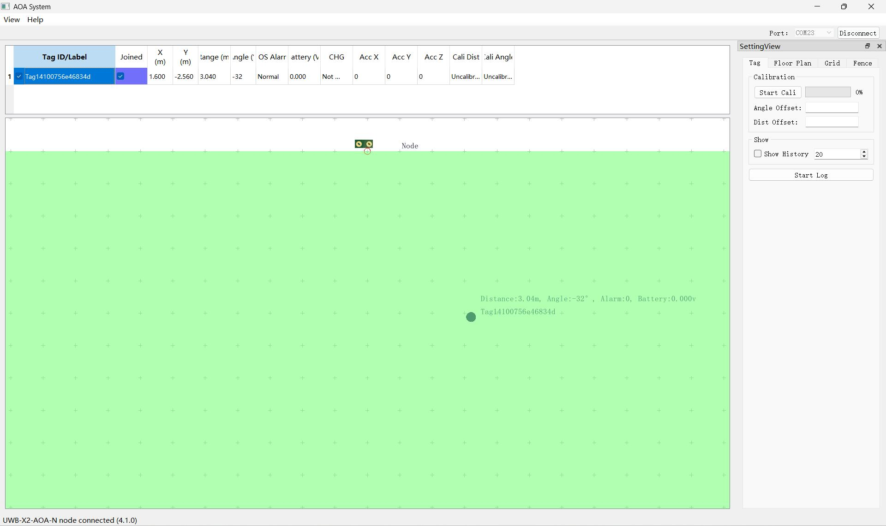

# UWB-AOA-with-Display-STM32F103C8T6

UWB AOA with Display STM32F103C8T6

# Makerfabs

[Makerfabs Homepage](https://www.makerfabs.com/)

[Makerfabs Wiki](https://wiki.makerfabs.com/)

# Feature:

• Controller: STM32F103C8T6, max 72MHz frequency, 1.25 DMIPS/MHz(Dhrystone 2.1), 64KB Flash memory, 20KB SRAM  

• DW3000 Module(Anchor):UWB-X3-AOA  

• DW3000 Module(Tag):UWB-X3-MAX  

• OLED: 1.3" SSD1306, 128X64, I2C  

• "Zero" Dropout: On board ideal diode circuit  

• Dual-USB Type C:USB-Native/USB-TTL  

• USB-to-UART: CH340K  

• Charger: TP4056  

• Button:RST/BTN  

• Expander: 2X12 2.54mm header  

• Open Source: hardware/firmware/software  

• Ranging error:< 10cm  

• Positioning error： <10cm  

• Frequency: CH5 (6.5 GHz)/CH9 (8 GHz)  

• Speed rate: 850 Kbps/6.8Mbps  

• Communication interface: SPI  

• Power Supply: USB 5.0V or 3.7V lithium battery  

# Usage:

1. Insert to USB-NATIVE port of AOA anchor.  
2. Insert to USB-TTL port of AOA tag(Or Powered by Li-battery).  
3. Open the AOA System Application.  
4. Select Tag ID and joined.  
5. Result Show:  

# Firmware

| Type | Default Firmware | 
|---|---|
| Anchor | Project\_Anchor\_v1.0.hex |
| Tag | Project\_Tag\_v1.0.hex |

# How to Program?

|ST-LINK V2 |AOA Anchor/Tag Board|  
| ---- | ---- | 
|SWCLK|SWCK|  
|SWDIO|SWIO|  
|GND|GND|  
|3.3V|+3.3V|  

